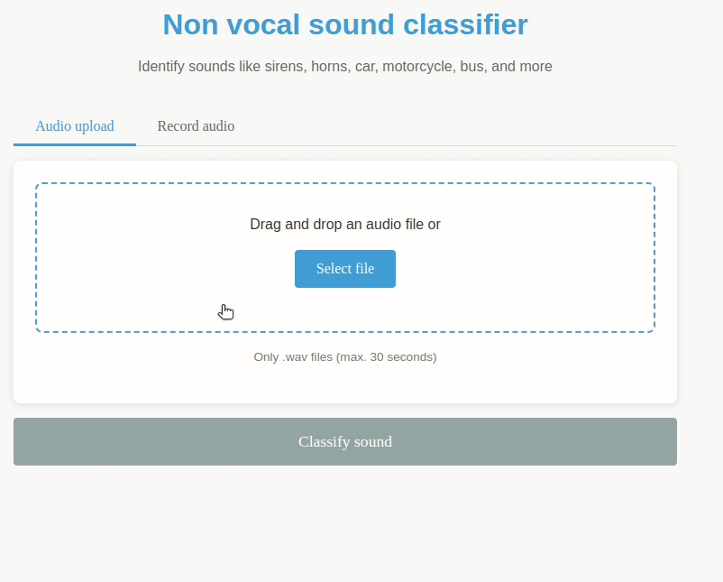
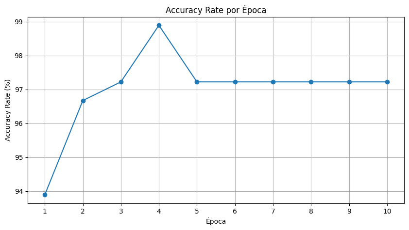
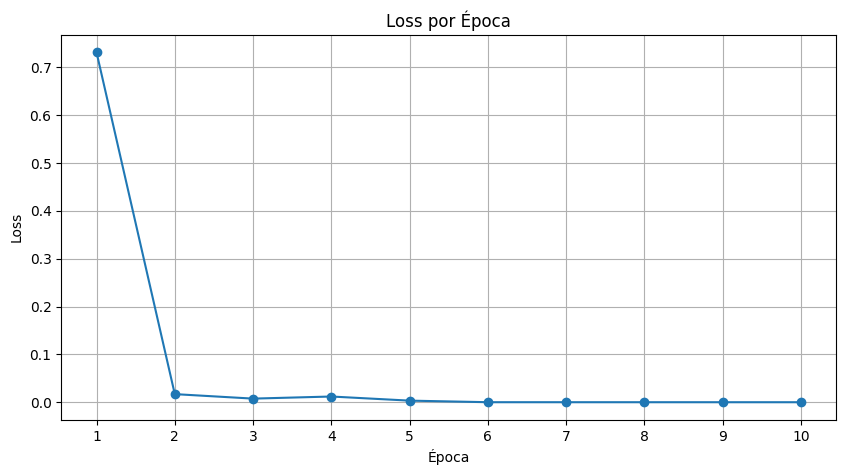

# Non-Vocal Sound Classifier

A GPT/Whisper-based system for identification and transcription of non-vocal sounds, such as sirens, falling objects, collisions, vehicle engines, etc.



## Description

This project is part of a research work aimed at developing a system capable of transforming non-vocal sounds into textual descriptions. We use a model based on OpenAI's Whisper, fine-tuned to identify different categories of environmental sounds.

## Project Structure


```
audio-classifier/
├── src/
│ ├── ml/ # Machine learning modules
| | ├── trained_model/ # Whisper model
│ ├── backend/ # FastAPI API
│ └── frontend/ # Web interface (Flask)
├── data/
| ├── report/ # Project documentation
│ ├── sounds/ # Training data
└── reports/ 
```

## Features

- Web interface for uploading or recording audio
- REST API for processing and classifying audio
- Support for .wav files
- Automatic processing to 16kHz frequency
- 30-second limit per audio
- Model trained to identify various categories of non-vocal sounds

## Requirements

- Python 3.8+
- PyTorch
- Whisper
- FastAPI
- Flask
- Other dependencies specified in requirements.txt

## Download and Installation

### Source Code
1. Clone the repository:
   ```bash
   git clone https://github.com/rubemalmeida/audio-classifier.git
   cd audio-classifier
   ```
2. Install dependencies: `pip install -r requirements.txt`

### Trained Model

The trained model files are not included in the repository due to their size. Download them from Google Drive:

1. Download the trained model: [Google Drive Link](https://drive.google.com/file/d/1_jUH7RhhlAFckbW28l4_BtzPe5taEgQP/view?usp=drive_link)
2. Extract the downloaded zip file
3. Place the model files in `src/ml/` directory

### Research Report

To download out research report:

1. Access the PDF directly: [relatorio.pdf](https://github.com/rubemalmeida/audio-classifier/blob/main/data/reports/relatorio.pdf)
2. Or find it in the `data/reports/` directory after cloning the repository 

## Running the Application

### Backend API

Start the FastAPI backend server:

```bash
python -m src.backend.main
```
The API will be available at `http://localhost:8000`.

### Frontend Web Interface

In a separate terminal, start the Flask frontend server:

```bash
python -m src.frontend.app
```
The web interface will be available at http://localhost:5000

## Usage

1. Ensure both backend and frontend servers are running
2. Open your web browser and navigate to http://localhost:5000
3. Upload an audio file (.wav format) or record a new one using your microphone
4. Click on "Classify Sound"
5. View the classification results showing the detected sound type and confidence level

## Model Training

To train a new model:

```bash
# Method 1: Using the Jupyter notebook
jupyter notebook src/ml/train.ipynb

# Method 2: Using the training script
python src/ml/train.py --audio_dir "data/sounds" --model_size "small" --epochs 10
```

## Results

Some of the results obtained from the training process are shown below:


Figure 1: Accuracy rate per epoch


Figure 2: Loss rate per epoch
