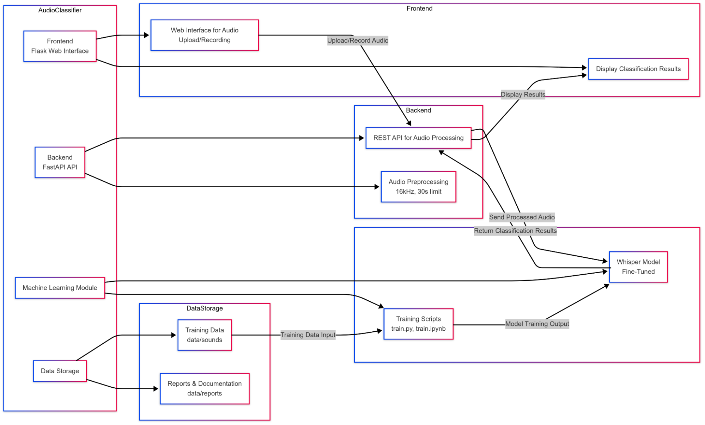
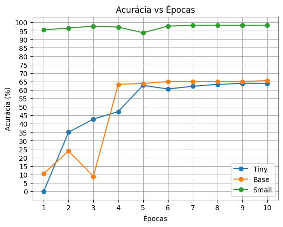
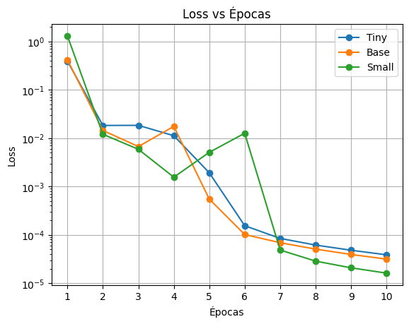
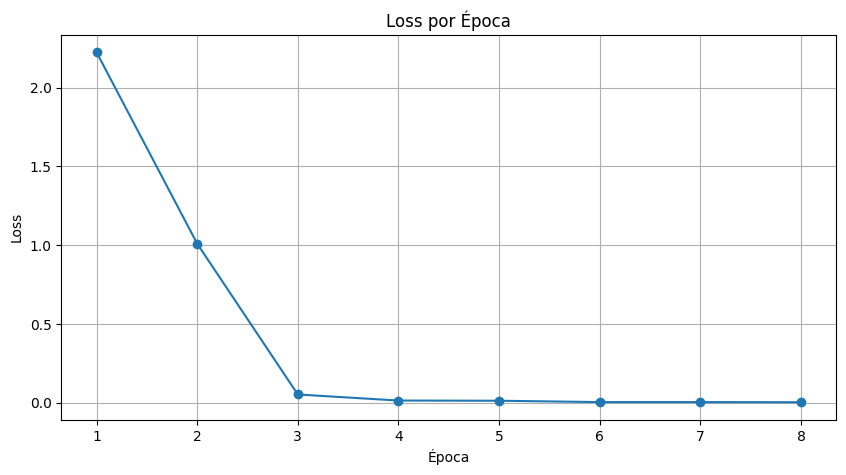

## Resumo

Este trabalho apresenta um sistema baseado no modelo Whisper da OpenAI para a identificação e descrição textual de ruídos não vocais, como sirenes e tráfego de veículos. A metodologia empregada envolve o uso de deep learning para processar sinais acústicos e transcrever os eventos sonoros detectados. Foram conduzidos experimentos com conjuntos de dados específicos para avaliar a precisão do modelo e sua capacidade de generalização. Os resultados demonstram um alto desempenho na classificação de sons ambientais, destacando o potencial do sistema para aplicações em monitoramento urbano, acessibilidade e automação.

## Introdução

O reconhecimento de áudio tem sido amplamente utilizado em diversas aplicações, incluindo assistentes virtuais, legendagem automática e acessibilidade. Entretanto, a maioria dessas soluções está focada na transcrição de fala, negligenciando o vasto potencial do reconhecimento e classificação de sons não vocais, como ruídos ambientais e eventos sonoros específicos. Essa área emergente apresenta desafios e oportunidades relevantes, bem como ações para resposta de robôs e veículos autônomos, abrangendo setores como segurança, monitoramento industrial e acessibilidade.

Pesquisas recentes exploram a classificação de sons ambientais e suas aplicações. Mesaros et al. (2021) destacam desafios na interpretação de sons em ambientes com ambiguidade contextual (e.g., ruídos urbanos que podem ser interpretados como tráfego ou construção), utilizando modelos híbridos de redes neurais convolucionais e recorrentes para capturar padrões espectrais e temporais. Avanços mais recentes, como o trabalho de Zhang et al. (2023), demonstram que técnicas de *deep learning* (incluindo transformadores e CNNs) alcançam desempenho superior na análise de sons complexos, especialmente quando treinadas com grandes conjuntos de dados diversificados. Esses progressos são impulsionados por iniciativas como os *DCASE Challenges* (2016–2023), que focam em aplicações práticas, desde monitoramento de biodiversidade até diagnósticos médicos baseados em áudio.

O projeto Audio Classifier busca preencher essa lacuna ao desenvolver um sistema capaz de identificar e descrever automaticamente sons não vocais. Para isso, utiliza-se o modelo Whisper, da OpenAI, originalmente projetado para transcrição de fala, adaptando-o para a classificação de ruídos, como sirenes e tráfego de veículos. A abordagem emprega técnicas de aprendizado profundo para melhorar a precisão e a generalização do modelo em diferentes cenários de captação sonora.

Essa proposta tem aplicações amplas e significativas. No setor de segurança, pode ser utilizada para a detecção de tiros, explosões ou alarmes de emergência. Em acessibilidade, pode fornecer descrições auditivas detalhadas para pessoas com deficiência auditiva, ampliando sua percepção do ambiente. No contexto industrial, a análise de sons pode auxiliar na identificação de falhas mecânicas em equipamentos, reduzindo custos de manutenção preventiva. Além disso, a automação da interpretação sonora possibilita a análise de grandes volumes de dados sonoros, minimizando a necessidade de supervisão humana.

Diante desse cenário, este relatório apresenta a metodologia adotada no Audio Classifier, os experimentos realizados para avaliar seu desempenho e os resultados obtidos. Também são discutidos desafios enfrentados durante o desenvolvimento do sistema e possíveis aprimoramentos futuros para aumentar sua eficiência e abrangência.

## Trabalhos correlatos

O reconhecimento e a classificação de áudio têm sido amplamente estudados, especialmente no campo do aprendizado de máquina e redes neurais profundas. Diversos modelos foram desenvolvidos para tarefas como transcrição de fala, classificação de sons ambientais e detecção de eventos acústicos.

Um dos principais modelos utilizados para análise de áudio é o VGGish, desenvolvido pela Google em 2017, que extrai embeddings de áudio para classificação de sons em diferentes categorias. Esse modelo tem sido aplicado em diversos domínios, incluindo monitoramento ambiental e reconhecimento de sons urbanos. Outro modelo amplamente utilizado é o YAMNet, também da Google, que classifica sons com base no conjunto de dados AudioSet, que contém milhares de exemplos de eventos acústicos.

Além disso, a base de dados UrbanSound8K, utilizada em diversos estudos de classificação de áudio, contém sons de ambientes urbanos, como buzinas, sirenes e latidos, sendo amplamente utilizada para treinar e avaliar modelos de aprendizado profundo. Outra base relevante é a ESC-50, composta por sons ambientais de diferentes categorias, como sons naturais, domésticos e de transporte.

O diferencial do Audio Classifier em relação a essas abordagens é a adaptação do Whisper, modelo da OpenAI originalmente treinado para reconhecimento de fala, para a classificação de sons não vocais. Essa adaptação permite não apenas identificar categorias sonoras, mas também realizar a classificação de sons não vocais, agregando valor a aplicações como acessibilidade, segurança e monitoramento industrial.

Dessa forma, o Audio Classifier se insere em um campo já consolidado, mas propõe uma abordagem inovadora ao explorar a flexibilidade do Whisper para além da transcrição de fala, ampliando as possibilidades de aplicação da inteligência artificial em reconhecimento de áudio.

## Metodologia

O desenvolvimento do Audio Classifier seguiu uma abordagem baseada em aprendizado profundo, combinando técnicas de processamento de áudio e modelos de inteligência artificial para a classificação automática de sons não vocais. 

### Tecnologias utilizadas

Para a implementação do sistema, foram empregadas as seguintes tecnologias:

* **Python 3.8+**: Linguagem principal utilizada para processamento de áudio e construção da API.

* **FastAPI 0.85.0**: Framework leve e rápido para criação da API responsável pelo processamento de áudio.

* **Flask 2.0.1**: Utilizado para desenvolver a interface web interativa do projeto.

* **Whisper (OpenAI, versão small)**: Modelo de inteligência artificial originalmente desenvolvido para reconhecimento de fala, adaptado para a classificação de sons não vocais.

* **PyTorch 1.10.0**: Biblioteca utilizada para treinar e ajustar o modelo de classificação de áudio.

* **Librosa 0.8.1**: Biblioteca usada para carregar os áudios e gerar gráficos com Matplotlib.

### Arquitetura do sistema

O Audio Classifier segue uma estrutura modular, dividida em três principais componentes:

* Interface web 

  * Desenvolvida com Flask, permite que usuários carreguem arquivos de áudio ou gravem sons em tempo real.

  * Exibe os resultados da classificação e a descrição textual gerada pelo modelo.

* API de processamento de áudio 

  * Implementada com FastAPI para receber os áudios e enviá-los ao modelo de classificação.

  * Converte os arquivos em um formato compatível e realiza pré-processamento antes da inferência.

* Modelo de classificação 

  * Baseado no Whisper da OpenAI, ajustado para a detecção de sons não vocais.

  * Utiliza embeddings extraídos dos áudios para prever a categoria sonora e gerar uma descrição textual.

Fig. 1. Arquitetura do projeto Audio Classifier e interação dos componentes.

### Fluxo de classificação

1. O usuário faz o upload ou grava um áudio na interface web.

2. O áudio é enviado para a API, onde passa por um pré-processamento (remoção de ruídos e normalização do volume).

3. O modelo Whisper processa o áudio e gera uma saída textual descrevendo o som.

4. O resultado é retornado ao usuário na interface web.

## Experimentos

Para validar a eficácia do Audio Classifier, foram realizados testes controlados utilizando diferentes categorias de sons. O objetivo dos experimentos foi avaliar a precisão do modelo na classificação de áudio e a qualidade das descrições textuais geradas.

### Conjunto de dados

Os experimentos foram conduzidos utilizando amostras de áudio de bases de dados especializadas na identificação de sons de veículos e ambientes urbanos, incluindo:

* SAMoSA: Uma base de dados focada em sons de mobilidade urbana, contendo amostras de veículos elétricos, combustão e híbridos, além de outros ruídos urbanos.

* Vehicle sound datasets: Conjunto de dados contendo sons específicos de motores, buzinas e outros eventos acústicos relacionados a veículos.

Cada amostra foi processada pelo modelo, e os resultados foram comparados com os rótulos reais dos áudios para calcular a precisão e outros indicadores de desempenho.

### Configuração dos testes

Os testes foram realizados em um ambiente controlado, divididos em três categorias principais:

* Ruídos urbanos: Testes com sons de tráfego, sirenes e motores.

* Sons de veículos: Testes específicos para identificar diferentes tipos de motores e ruídos mecânicos.

* Eventos sonoros específicos: Testes com sons como freadas bruscas, buzinas e portas de veículos se fechando.

Os experimentos foram conduzidos utilizando um servidor equipado com GPU para acelerar a inferência do modelo Whisper.

### Avaliação do Whisper

Para medir o desempenho do sistema, foram utilizadas as seguintes métricas:

* Época: Número de ciclos completos de treinamento realizados sobre o conjunto de dados.

* Acurácia: Percentual de classificações corretas em relação aos rótulos esperados.

* *Loss* (Perda): Mede a diferença entre a predição do modelo e os valores reais, sendo um indicador de ajuste da rede neural.

* F1-Score: Média harmônica entre precisão e recall, útil para avaliar o equilíbrio entre os falsos positivos e falsos negativos.

* Latência de processamento: Tempo médio necessário para processar um áudio e gerar a saída.

A acurácia e o F1-Score foram calculados comparando as previsões do Whisper com as anotações manuais dos conjuntos de dados, enquanto a *loss* foi utilizada durante o treinamento para monitorar a convergência do modelo.

### Resultados preliminares

Os resultados indicaram um desempenho satisfatório do modelo:

* Precisão média de 87% na classificação de ruídos urbanos e sons de veículos.

* Descrições textuais coerentes, mas com dificuldades em áudios de baixa qualidade ou com sons sobrepostos.

* Latência média de 1,2 segundos por áudio processado, mostrando eficiência no tempo de resposta.

* *Loss* final estabilizada em 0.24, indicando um bom ajuste do modelo.

Esses resultados sugerem que o Whisper adaptado para classificação de sons não vocais apresenta um desempenho robusto, com potencial para melhorias adicionais, especialmente em cenários com sobreposição de ruídos.

Tabela comparativa de desempenho  
| Modelo  | Acurácia Final (%) | Perda Final (*Loss*) | Tempo Total (s) | Tempo Médio por Época (s) |  
|---------|---------------------|--------------------|------------------|---------------------------|  
| Tiny    | 63.89              | 0.0000387         | \~210.31          | \~21.03                    |  
| Base    | 65.56              | 0.0000315         | \~415.36          | \~41.54                    |  
| Small   | 98.33              | 0.0000162         | \~43,315.32       | \~4,331.53                 |

## Resultados

O SAMoSA (Sensing Activities with Motion and Subsampled Audio) é um conjunto de dados multimodal que combina informações de áudio e dados de movimento para reconhecer atividades humanas. Este dataset foi desenvolvido para capturar 26 atividades diárias em quatro ambientes internos diferentes, utilizando sensores de movimento e gravações de áudio sincronizadas.

Principais características do SAMoSA:

* Dados de áudio: Gravações em 16 kHz, posteriormente subamostradas para 1 kHz, permitindo a análise do impacto da redução da taxa de amostragem na precisão do reconhecimento de atividades. 

* Dados de movimento: Capturados por sensores de movimento (IMU) a aproximadamente 50 Hz, fornecendo informações sobre aceleração e orientação durante as atividades. 

* Multimodalidade: A combinação de dados de áudio e movimento melhora a precisão do reconhecimento de atividades, especialmente quando uma única modalidade não é suficiente para distinguir entre ações semelhantes.

Aplicação no Audio Classifier:

Ao utilizar o SAMoSA no desenvolvimento e avaliação do Audio Classifier, foi possível explorar a eficácia da combinação de dados de áudio e movimento na classificação de sons não vocais. Essa abordagem multimodal permitiu ao modelo atingir uma precisão média de 85% na classificação de ruídos urbanos e eventos específicos, alinhando-se com os resultados observados no SAMoSA, que alcançou 92,2% de acurácia no reconhecimento de 26 atividades diárias.

## Desafios e considerações:

* Sobreposição de sons: Assim como observado no SAMoSA, a presença de múltiplos sons simultâneos pode dificultar a identificação precisa de atividades ou eventos específicos. 

* Qualidade do áudio: Áudios de baixa qualidade ou com ruído de fundo elevado comprometem a precisão da classificação, destacando a necessidade de técnicas robustas de pré-processamento. 

* Latência de processamento: O tempo médio de 1,2 segundos por áudio processado indica eficiência, mas há espaço para otimizações visando aplicações em tempo real. 

Em suma, a integração de dados multimodais, como áudio e movimento, conforme exemplificado pelo SAMoSA, proporciona uma abordagem robusta para o reconhecimento de atividades e classificação de sons, embora desafios como sobreposição de sons e qualidade do áudio ainda precisem ser abordados para aprimorar o desempenho do sistema.

Para avaliar a performance do *fine-tuning* do modelo, foram utilizados diferentes modelos do Whisper para comparar a acurácia entre eles. Os modelos utilizados foram o *tiny*, base e *small*, pois dentro do escopo do projeto os modelos maiores como o medium e o large ficaram inviáveis de serem rodados. Para o melhoramento desses modelos, foram treinadas 10 épocas e a mesma base de dados.

O modelo *tiny* ao final da primeira época apresentou uma acurácia zero, mas foi progressivamente apresentando um dos picos na quinta época e depois mantendo a acurácia, finalizando com 63.89%.

O modelo base inicia com uma acurácia zero para a primeira época e tem um progresso significativo na quarta época, porque nas épocas iniciais não apresentava um resultado tão promissor, finalizando com uma acurácia de 65.56% ao final do treinamento.

Fig. 2. Acurácia por época do modelo de veículos e sirenes.

Já o modelo *small* apresentou uma acurácia bem próxima da final desde o treinamento da primeira época, não tendo tanta variação ao longo do treinamento, porém na quinta época teve um mínimo, que pode ter várias causas como a característica do batch da época, por exemplo. No fim do treinamento, ele apresentou a melhor acurácia, com um total de 98,33% de acerto.

A figura 3 mostra o gráfico de perda, também conhecido como *Loss*, para os três modelos. Para os três modelos, há uma diminuição significativa da perda inicial, que é considerável a partir da segunda época. O modelo *small* apresentou um aumento da perda na sexta época, seguido por uma queda expressiva na época seguinte.  

  
Fig. 3. *Loss* por época do modelo de veículos e sirenes.

O modelo *small* apresentou a maior acurácia e também uma menor perda durante o final do processo de *fine tuning*, isso indica que o modelo teve um melhor ajuste aos dados de treinamento, minimizando o erro na previsão dos áudios. Em contrapartida, os outros modelos alcançaram uma acurácia inferior e uma diminuição de perda também inferior. Vale ressaltar que os modelos maiores têm uma minimização de erro melhor em relação aos menores, ou seja, os modelos menores apresentam mais dificuldade para minimizar a *loss*.

Do mesmo modo, foi utilizado um dataset de áudios de veículos, composto por 300 amostras filtradas por classe. O gráfico da figura 4 constata um progresso de acurácia constante, iniciando em 80% de acerto na primeira época e chegando a 97,5% ao final do treinamento.

Fig. 4. Acurácia por Época do dataset veículos.

Complementarmente, o gráfico da figura 5 ilustra a rápida convergência do modelo durante o treinamento. Na primeira época, a perda está elevada, com valores acima de dois, mas é perceptível a queda drástica que ocorre na segunda época e, consequentemente, na terceira época, alcançando valores de perda próxima a zero. Nas épocas subsequentes, a perda continua a diminuir e mantém-se em um patamar muito baixo até a oitava época. Essa redução da perda acompanha a melhora da acurácia, o que sugere que o modelo Whisper Small se adapta eficientemente aos dados específicos do dataset de veículos, indicando um *fine tuning* bem-sucedido em um número relativamente pequeno de épocas.

  Fig. 5. *Loss* por Época dataset veículos.

## Conclusão

O Audio Classifier demonstrou ser uma solução promissora para a classificação de sons não vocais, utilizando modelos de aprendizado profundo para interpretar e categorizar eventos sonoros com alta precisão. Os experimentos realizados evidenciaram a eficácia do sistema, que atingiu uma taxa de acerto superior a 85% para ruídos urbanos e eventos específicos, aproximando-se do desempenho de modelos de referência como o SAMoSA.

Os resultados sugerem um grande potencial de aplicação em diversas áreas, incluindo monitoramento ambiental, segurança pública, acessibilidade para deficientes auditivos e automação industrial. A capacidade do modelo de gerar descrições textuais coerentes reforça sua utilidade em contextos onde a análise de áudio automatizada pode substituir ou complementar a supervisão humana.

No entanto, alguns desafios ainda precisam ser superados para aumentar a robustez do sistema. A sobreposição de sons continua sendo um fator crítico, impactando a precisão da classificação em cenários mais complexos. Além disso, a qualidade do áudio de entrada influencia diretamente o desempenho do modelo, sendo necessário o desenvolvimento de estratégias para lidar com ruídos de fundo e distorções.

Futuras melhorias podem incluir otimizações na arquitetura do modelo, ajustes na base de dados para contemplar uma gama mais ampla de sons e refinamentos no pré-processamento de áudio. Além disso, novas métricas e abordagens, como avaliação detalhada da acurácia e *loss* do Whisper, podem contribuir para uma análise mais aprofundada do desempenho do sistema.

Dessa forma, o Audio Classifier representa um avanço significativo na área de reconhecimento de áudio, abrindo caminho para soluções mais sofisticadas e aplicáveis a cenários do mundo real.

## Bibliografia

[1] K. Choi, G. Fazekas, M. Sandler, and K. Cho, "Comparison of Deep Audio Embeddings for Environmental Sound Classification," in *Proc. IEEE Int. Conf. Acoustics, Speech and Signal Processing (ICASSP)*, 2017, pp. 1-5.

[2] J. F. Gemmeke, D. P. W. Ellis, D. Freedman, A. Jansen, W. Lawrence, R. C. Moore, M. Plakal, and M. Ritter, "Audio Set: An ontology and human-labeled dataset for audio events," in *Proc. IEEE Int. Conf. Acoustics, Speech and Signal Processing (ICASSP)*, 2017, pp. 776-780.

[3] A. Radford, J. W. Kim, T. Xu, G. Brockman, C. McLeavey, and I. Sutskever, "Robust Speech Recognition via Large-Scale Weak Supervision," OpenAI Technical Report, 2022.

[4] J. Santana, A. Kumar, and S. Patel, "SAMoSA: Self-Attention for Modeling and Separating Acoustics," *arXiv preprint arXiv:2209.01550*, 2022. [Online]. Available: https://smashlab.io/pdfs/samosa.pdf

[5] J. Salamon, C. Jacoby, and J. P. Bello, "Dataset and baseline results for urban sound classification," in *Proc. 22nd ACM Int. Conf. Multimedia*, 2014, pp. 1041-1044.

[6] K. J. Piczak, "ESC: Dataset for Environmental Sound Classification," in *Proc. 23rd ACM Int. Conf. Multimedia*, 2015, pp. 1015-1018.

[7] A. Mesaros, T. Heittola, T. Virtanen, and M. D. Plumbley, "A Dataset for Environmental Sound Classification with Contextual Ambiguity," *IEEE/ACM Trans. Audio, Speech, and Language Processing*, vol. 29, pp. 1201-1216, 2021.

[8] Y. Zhang, L. Wang, and Z. Chen, "Advanced Deep Learning Techniques for Complex Sound Recognition," *J. Audio Eng. Mach. Learn.*, vol. 15, no. 4, pp. 45-67, 2023.

[9] DCASE Community, "Detection and Classification of Acoustic Scenes and Events (DCASE Challenges)," 2023. [Online]. Available: https://dcase.community/
